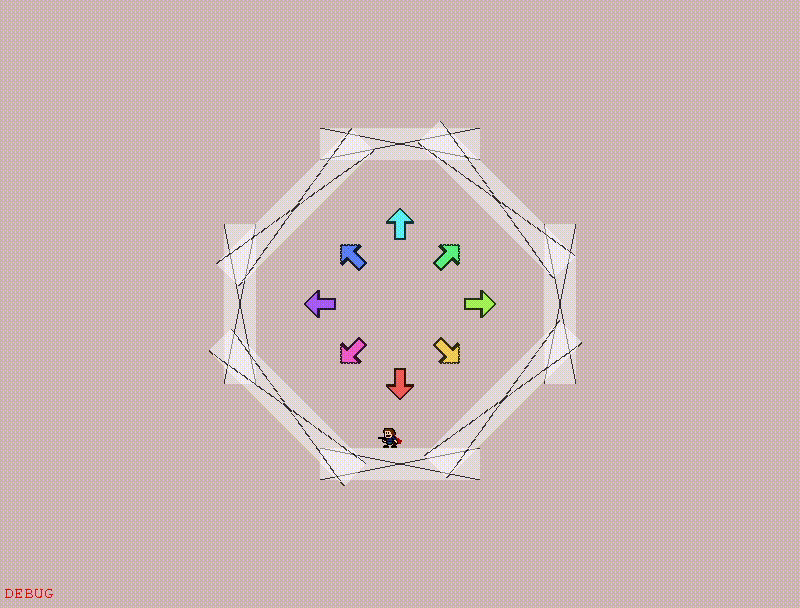
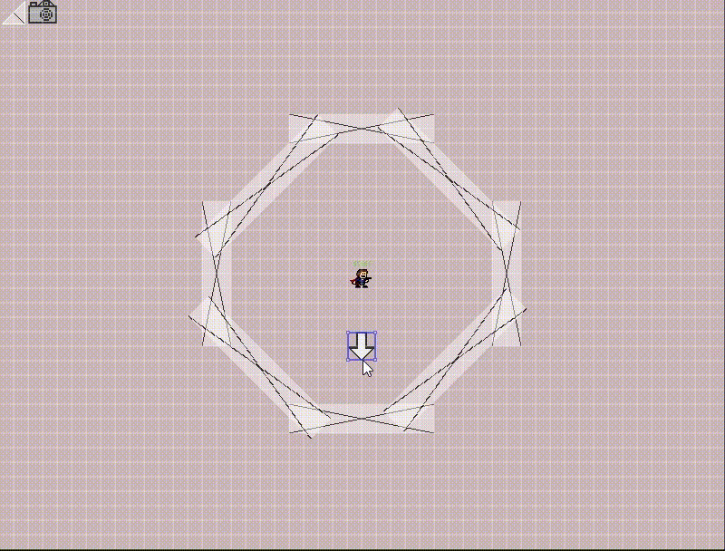
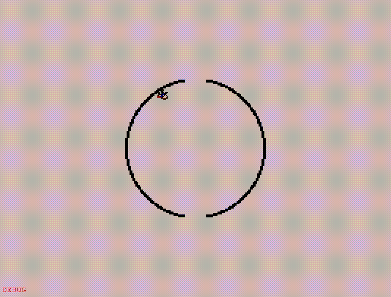

## Synth-Engine-GMS2.3
Assets that can be used to create fangames in GMS2.3

# Features:
Variable framerate settings (50 - 360fps)

360 gravity (rotate oGravityArrow in the editor)

A simple weapons system - Modify or inherit from oWeapon to:
 - Fire any object
 - Make weapon pickup stands
 - Turn on autofire (boolean)

Slopes:
 - Inherit from oBlock and create any precise shape you like
 - Fully compatible with 360 gravity

Handy structs (vec2, mat2, etc.) and relevant math functions

No monolithic world object (see explanation below)

)
)
)

# How to set up:
 - Click code button and press download in the drop-down
 - Open 'Synth-Engine-GMS2 v140.yyp' in Gamemaker (Gamemaker Studio 2)
 - Save As... to rename your project (optional)

# Engine versions (branches):
tldr;

Other version numbers are mainly here for legacy purposes.

v140 (in main) is the most stable, which is why I recommend you use it.

# v140 (main):
Adds 360 gravity, slopes and the weapon system.
If you don't want to deal with the slightly more complicated player code I recommend you go for v130

# v130:
Adds controller support (also in v140)
Doesn't have the weapons system but is mostly up to date otherwise

# v120-weapons:
As the name implies has the weapons system. You may bring it over to v130 if you want the code improvements and weapon system
This version uses some outdated file i/o methods that may force you to write your own saving system if you
want to save anything slightly complicated

# v110:
Legacy, don't use. Has a lotta bugs.

# v097 and older:
This version of the engine works for GMS2 2.2 and earlier
Uses very outdated methods for mostly everything
But I used this to make Platform God and HTec
https://github.com/Synthasmagoria/Synth-Engine-GMS2

# How to work with variable framerate:
There are two global variables
global.fps_adjust (fps_calculation in old version):
Multiply or divide this variable with the variables that need to change at different framerates
There's also global.fps_adjust_squared for variables that are responsible for
exponential change over time - such as gravity

# World
This (fangame-) engine does not have a monolithic world object that takes care of everything persistent.
Instead there are a lot of other more specific object that handle each of their own task.
What they do is implied in what they're called oAudio, oInput, oSaveData, oGame.

If you want to change saving behavior, then modify oSaveData & scrSavedata
If you want to modify the way sound and music works then go into oAudio, scrAudio and scrRoomMusic
Hopefully this makes sense.

# Games I made using this (And source code if they're released)
Platform God:

Game: https://synthasmagoria.neocities.org/games/temple/temple.html

Source: https://github.com/Synthasmagoria/I-Wanna-Pray-to-the-Platform-God

HTec:

Itch: https://synthasmagoria.itch.io/htec

NUCLEAR PHYSICIST:

Game: https://delicious-fruit.com/ratings/game_details.php?id=24345

Source: https://github.com/Synthasmagoria/NUCLEAR-PHYSICIST

# Contact
Discord: Synthasmagoria#6751

Twitter: https://twitter.com/SynthasA
